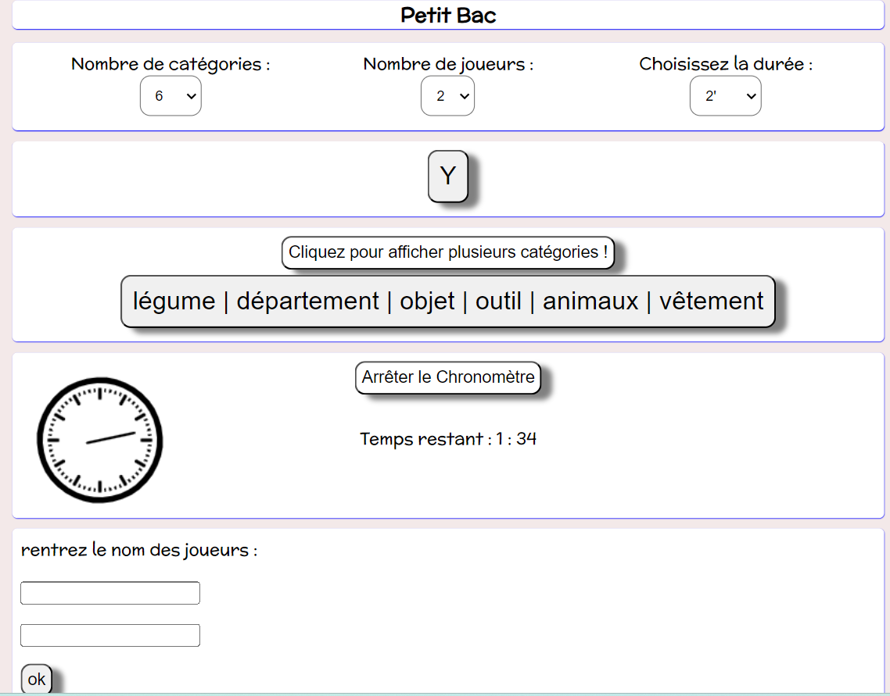

# Petit Bac 

Application web du célèbre jeu, en javaScript, avec un serveur Apache php.
Une démo est disponible ici http://erwan-diato.com/petitbac/ .
Plusieurs catégories aléatoires sont proposées, il est possible de choisir entre 6 et 11 catégories. 
On peut entrer le nom des joueurs et rentrer leurs scores. Le programme propose un chronomètre avec choix de la durée.

Pour installer le programme :

> docker-compose up -d --build 

Pour jouer : 

> http://localhost:8111/ 

